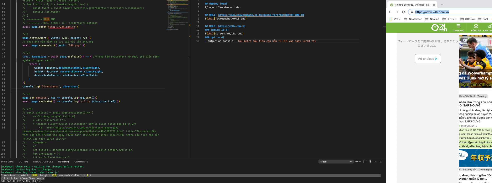

# puppeteer-get-href-title 🐳

## deploy local
1. `npm i`
2. `nodemon index`

## URL1: https://www.easycompare.co.th/quote-form?formID=HP-CMB-TH

## URL3: https://24h.com.vn
### option 1)~3)

### option 4)
- output on console: `Tàu metro đầu tiên cập bến TP.HCM vào ngày 10/10 tới`
